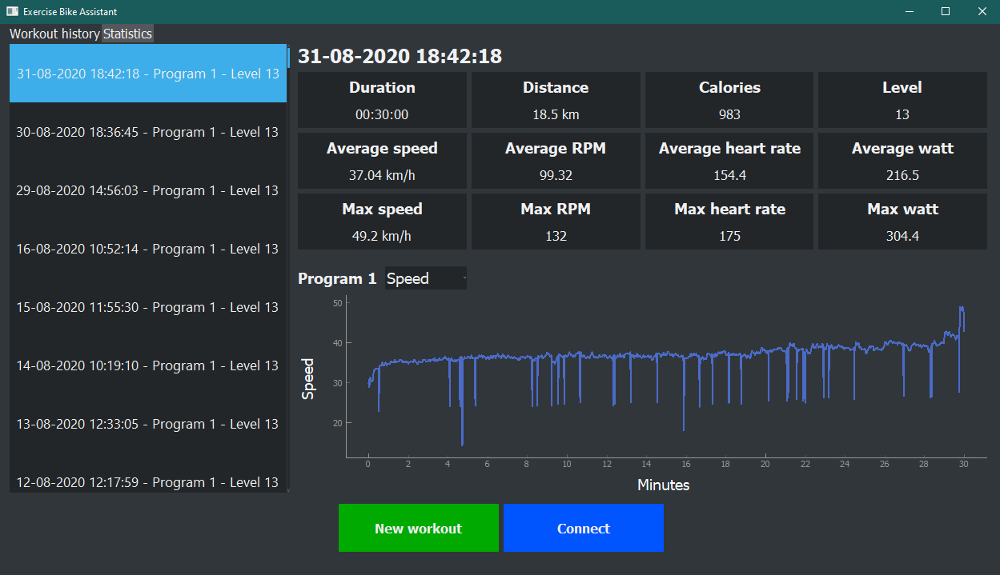
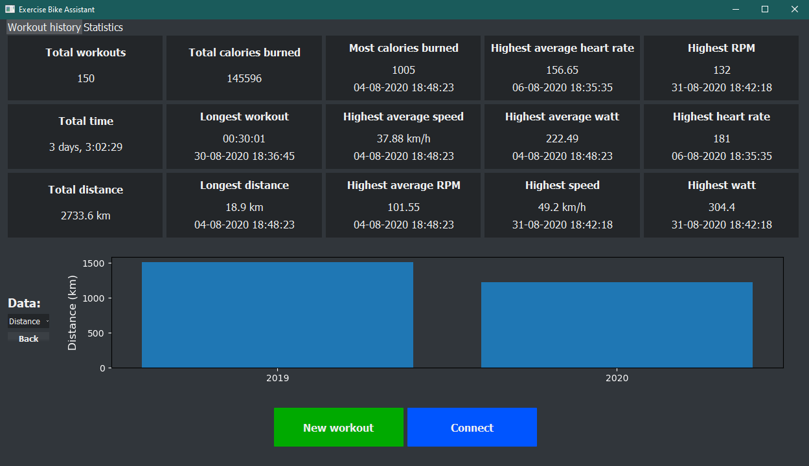
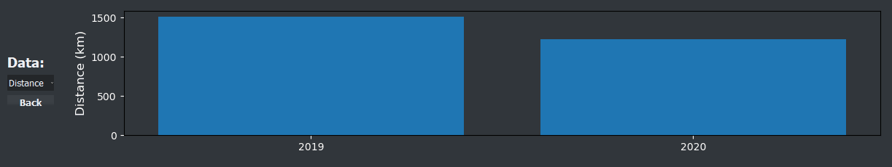
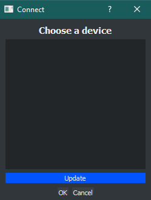
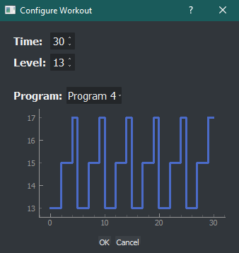
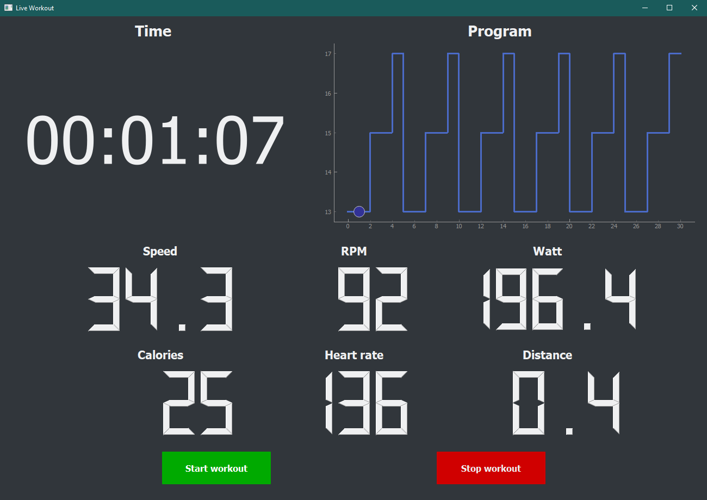

# Exercise bike logger
Desktop application for iConsole compatible exercise bikes, created using PyQT. Connects with the exercise bike through Bluetooth and lets the user start a new workout and see live data while the workout is ongoing. When a workout is finished it is automatically logged and added to the workout history, which shows every workout session completed through the application. Statistics related to the workout history as a whole can also be seen to give a more comprehensive look at the progression of the users workouts.

## Design
The project is designed using an object-oriented approach where program execution starts from the **main.py** file. The main UI is implemented in the **resources/mainwindow.ui** file and UI functionality related to the main window is implemented in the **main_window.py** file. The latter connects all elements of the main window UI with their corresponding functions. This design pattern of having a python file for each UI file is used for each window in the UI. This includes the aforementioned main window, the connect dialog window, the dialog window used to configure a new workout and the window showing live data during a workout. Note that the multiple tabs in the main window are implemented using a python file for each tab.

The workout history tab is built around a list of every workout completed through the application. This list is implemented in the **workout_list_model.py** file. Note that this class inherits from **QAbstractListModel** which means that we can use it directly as the internal model for the QListView that is used in the UI. The most interesting element of the statistics tab is the interactive matplotlib graph that shows yearly, monthly and daily totals. To use a matplotlib graph in a QT UI, it is necessary to define a custom widget which supports matplotlib, which is done in the **mplwidget.py** file. 

When the "New workout" button is clicked the user is prompted to configure the time, resistance level and program of the workout. The individual workout programs are implemented in the **workout_program.py** file. When the "Start workout" button on the live workout page is clicked, a bluetooth session instance, defined in **bluetooth_session.py**, is created. This instance is responsible for connecting to the bike and continuously gathering data from the bike throughout the session. The workout session itself is represented by a WorkoutSession instance implemented in the **workout_session.py** file. This instance is responsible for saving the data while the workout in ongoing, processing the data after the workout and saving the processed data to a json file.

The **Settings.py** file defines methods that can be used throughout the application to load and save the connection settings. This includes the MAC address of the connected device and the UUID of the characteristic that is used to gather data from the exercise bike. Support for concurrency, which ensures that the UI is responsive while performing larger tasks is implemented in the **worker.py** file.

## Graphical user interface
The user interface was created using the Qt framework.

The main window consists of two tabs, the workout history and the statistics.
### Main window (Workout history tab)


The workout history shows detailed data about each workout completed through the application. Each individual workout can be chosen from the list on the left, which then updates the display on the right with data from that workout. The graph on the bottom half of the display can be configured to show "Speed", "RPM", "Heart rate", "Watt", "Distance", "Calories" and "Level".

### Main window (Statistics tab)


The statistics tab shows information about the user's workout history as a whole. The upper half shows both totals, like the total distance of all the workouts and records, like the highest average speed of a workout. Each record shown on the statistics tab also displays the date of the workout where the record was achieved. Clicking this date will take the user to the specific workout on the workout history tab. The statistics tab also contains an interactive graph that shows yearly, monthly and daily data. The graph can be configured to show "Workouts" meaning the number of workouts, "Time", "Distance" and "Calories".



### Connect dialog window


The connect dialog window is used to connect to the exercise bike that is used in the workouts. The window is opened by clicking the "Connect" button in the main window. Clicking "Update" will update the central list with all nearby Bluetooth LE devices. Clicking a device on the list and clicking "OK" will then save the device in the connection settings so it can be used to connect to the exercise bike when a new workout is started.

### Configure workout dialog window


When the "New workout" button in the main window is clicked, the configure workout dialog window is opened. This window allows the user to configure the duration, resistance level and program of the new workout. When the "OK" button is clicked a new workout is created with the chosen configuration and the live workout window is opened.

### Live workout window


The live workout window shows live data related to the currently ongoing workout. When the workout is in progress the display is updated every second with the newest data from the exercise bike.

## Requirements
A conventional requirements file is included which means that all dependencies can be installed by navigating to the project directory and typing the following in your cmd:
```
$ pip install -r requirements.txt
```
